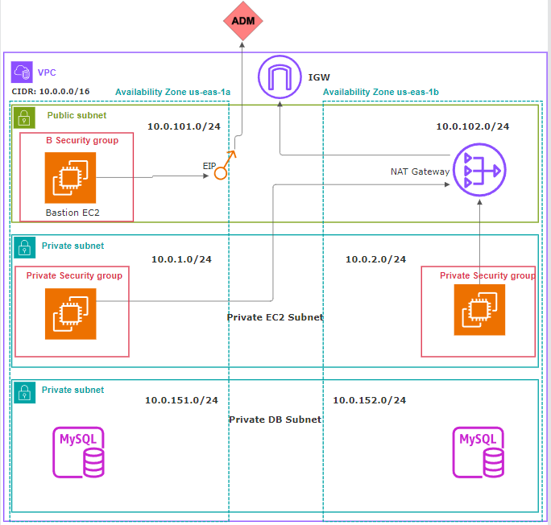

# Terraform AWS 3-Tier VPC with EC2




In continuation of the last example, this example demonstrates how to expand a foundational VPC into a full 3-tier architecture. It shows how to provision EC2 instances, configure separate security groups for public and private tiers, and set up a secure Bastion host for administrative access.
This example deploys a highly available, 3-tier network architecture on AWS using Terraform. It expands on a foundational VPC by provisioning a secure Bastion Host in the public subnet and two private EC2 instances in the private application subnets.

This infrastructure is ideal for hosting secure applications, with a public-facing entry point for administrators (Bastion) and an isolated private layer for application logic.

## 🏗️ Architecture

The infrastructure created by this Terraform configuration follows a classic 3-tier design:

* **VPC:** A single VPC (`10.0.0.0/16`) spans two Availability Zones (`us-east-1a`, `us-east-1b`) for high availability.
* **Tiers (Subnets):**
    * **Tier 1: Public Subnets** (`10.0.101.0/24`, `10.0.102.0/24`):
        * These subnets are accessible from the internet via an **Internet Gateway (IGW)**.
        * A **Bastion Host** (EC2 instance) is placed in `us-east-1a`'s public subnet. It has an **Elastic IP (EIP)** and is the secure, single entry point for administrators.
    * **Tier 2: Private App Subnets** (`10.0.1.0/24`, `10.0.2.0/24`):
        * These subnets are not reachable from the internet.
        * Two **Private EC2 Instances** are launched, one in each AZ, to host the application.
        * A **single NAT Gateway** is deployed in `us-east-1b`'s public subnet to give the private instances outbound-only internet access (e.g., for software updates).
    * **Tier 3: Private DB Subnets** (`10.0.151.0/24`, `10.0.152.0/24`):
        * These subnets are fully isolated and intended for the database layer (MySQL in the diagram). They have no route to the internet.
* **Security:**
    * **`public-bastion-sg`:** A security group for the Bastion Host that allows SSH (port 22) from all IPs (`0.0.0.0/0`).
    * **`private-sg`:** A security group for the private EC2 instances that allows SSH (port 22) and HTTP (port 80) *only from within the VPC* (`10.0.0.0/16`).

### Key Modules Used

* **`terraform-aws-modules/vpc/aws`**: Used to create the VPC, all 6 subnets (public, private app, private DB), the Internet Gateway, and the NAT Gateway.
* **`terraform-aws-modules/security-group/aws`**: Used to create the `public-bastion-sg` and `private-sg` security groups.
* **`terraform-aws-modules/ec2-instance/aws`**: Used to provision the public Bastion Host (`ec2_public`) and the two private EC2 instances (`ec2_private`).

## 🚀 Prerequisites

Before you can deploy this infrastructure, you must have the following:

1.  **Terraform CLI** installed.
2.  **AWS Account** and **AWS CLI** configured with the necessary permissions.
3.  **An EC2 Key Pair**: This configuration requires an existing EC2 key pair. The `instance_keypair` variable defaults to `mmd-admin-key-us-east-1`.
4.  **Private Key File**: You must have the corresponding private key file (`.pem`) locally. The provisioner block expects it at `private-key/mmd-admin-key-us-east-1.pem`.

## 🛠️ Deployment Steps

1.  **Clone the repository:**
    ```sh
    git clone <your-repo-url>
    cd <your-repo-directory>
    ```

2.  **Ensure your private key is in place:**
    * Create a directory named `private-key`.
    * Place your `mmd-admin-key-us-east-1.pem` file inside it.

3.  **Initialize Terraform:**
    This will download the necessary provider plugins and modules.
    ```sh
    terraform init
    ```

4.  **Review the execution plan:**
    This shows you what resources Terraform will create, modify, or destroy.
    ```sh
    terraform plan
    ```

5.  **Apply the configuration:**
    This will build the infrastructure on your AWS account.
    ```sh
    terraform apply
    ```
    Type `yes` when prompted to approve the plan. Terraform will now provision all resources, which may take a few minutes.

## SSH and Provisioner Workflow

A key part of this project is the `null_resource` which automates setting up the Bastion Host for SSH forwarding (as a "jump host").

* **`aws_eip "bastion_eip"`**: Assigns a static Elastic IP to the Bastion Host.
* **`null_resource "name"`**:
    1.  **`connection "ssh"`**: Connects to the newly created Bastion Host using its EIP and your local private key.
    2.  **`provisioner "file"`**: Copies your local private key (`mmd-admin-key-us-east-1.pem`) *to* the Bastion Host and places it in `/tmp/`.
    3.  **`provisioner "remote-exec"`**: Runs a command *on the Bastion Host* to set the correct permissions (`chmod 400`) on the key, which is required for SSH.

This setup allows you to SSH into the bastion, and from there, SSH into your private instances.

## 🖥️ How to Access Your Instances

1.  **Get the Bastion Host's IP:**
    After `terraform apply` is complete, find the `ec2_bastion_public_ip` in the outputs.
    ```sh
    terraform output ec2_bastion_public_ip
    ```

2.  **SSH into the Bastion Host:**
    ```sh
    ssh -i "private-key/mmd-admin-key-us-east-1.pem" ec2-user@<BASTION_PUBLIC_IP>
    ```

3.  **SSH into a Private Instance (from the Bastion):**
    First, get the private IP of one of your instances from the Terraform output.
    ```sh
    terraform output ec2_private_ip
    ```
    Now, from *inside* the Bastion's SSH session, use the key you provisioned to "jump" to the private machine.
    ```sh
    # This command is run ON THE BASTION
    ssh -i "/tmp/mmd-admin-key-us-east-1.pem" ec2-user@<PRIVATE_INSTANCE_IP>
    ```

4.  **Verify the Web Server:**
    Once you are on the private instance, you can check if the `app1-install.sh` script worked:
    ```sh
    # This command is run ON THE PRIVATE INSTANCE
    curl http://localhost
    ```
    You should see: `<h1>Welcome to Webserver - APP-1</h1>`

## 📋 Key Resources Created

* **1 x VPC**
* **6 x Subnets** (2 public, 2 private app, 2 private DB)
* **1 x Internet Gateway**
* **1 x NAT Gateway**
* **1 x Elastic IP** (for the Bastion)
* **3 x EC2 Instances** (1 public bastion, 2 private app)
* **2 x Security Groups** (public and private)
* **Multiple Route Tables** (for public, private, and DB subnets)

## 📤 Terraform Outputs

This project provides the following outputs for your convenience:

* `vpc_id`: The ID of the created VPC.
* `vpc_cidr_block`: The CIDR block of the VPC.
* `private_subnets`: List of IDs for the private application subnets.
* `public_subnets`: List of IDs for the public subnets.
* `nat_public_ips`: The public IP of the NAT Gateway.
* `azs`: The Availability Zones used.
* `public_bastion_sg_group_id`: The ID of the Bastion's security group.
* `private_sg_group_id`: The ID of the private instances' security group.
* `ec2_bastion_public_instance_ids`: The instance ID of the Bastion Host.
* `ec2_bastion_public_ip`: The public EIP of the Bastion Host.
* `ec2_private_instance_ids`: List of instance IDs for the private EC2s.
* `ec2_private_ip`: List of private IPs for the private EC2s.
